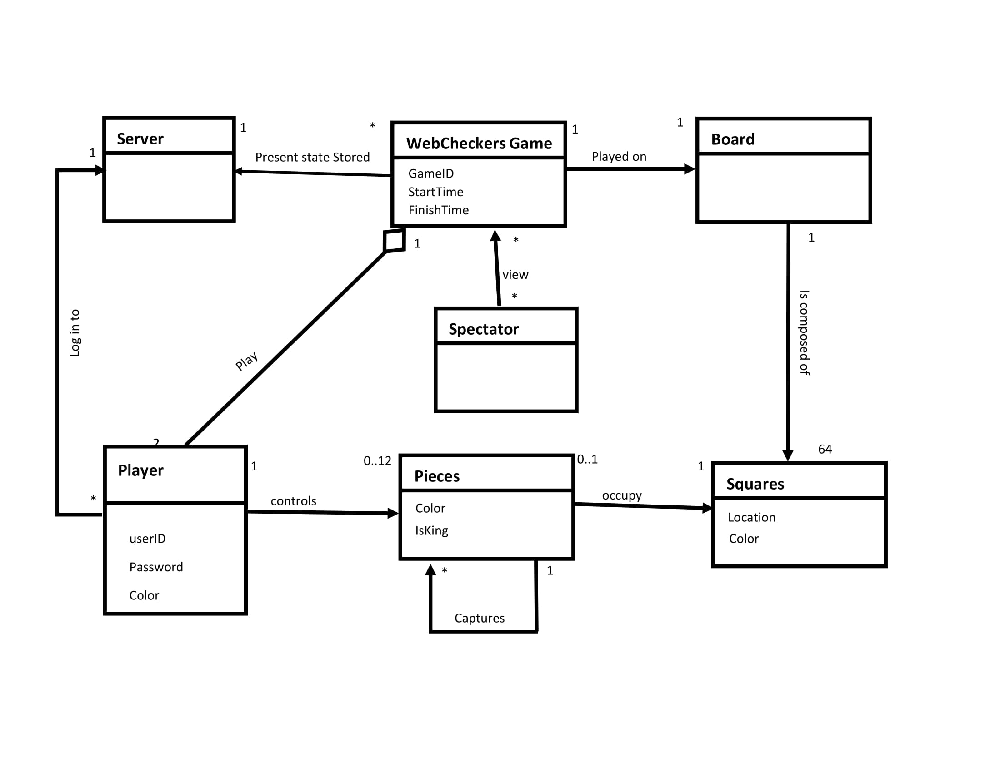
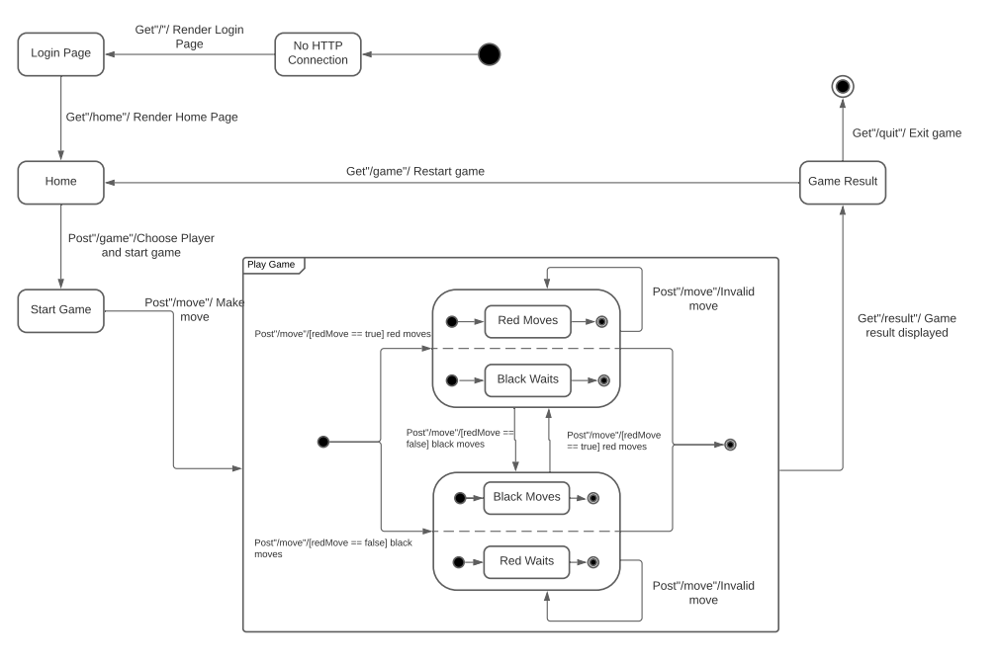
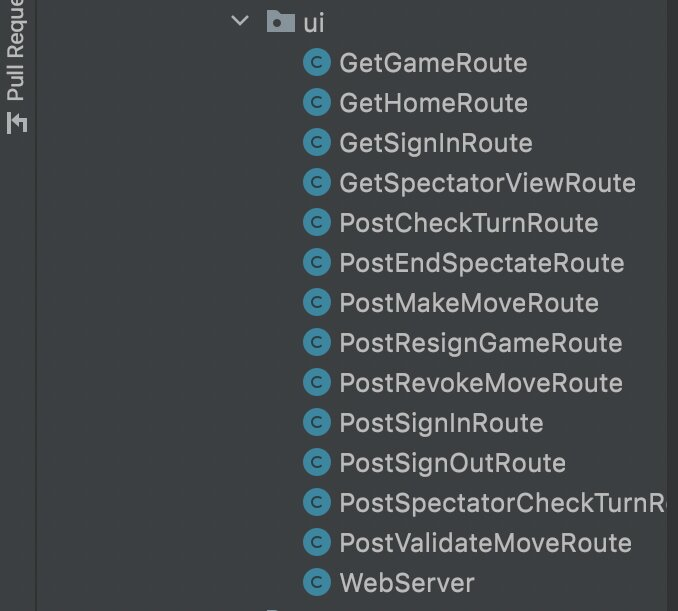
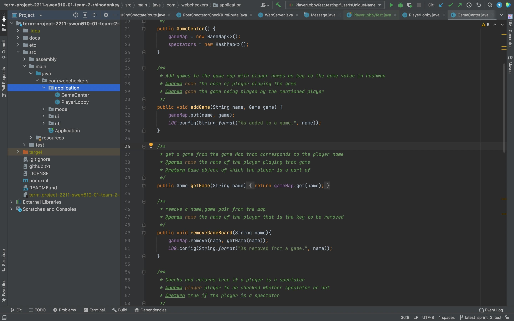
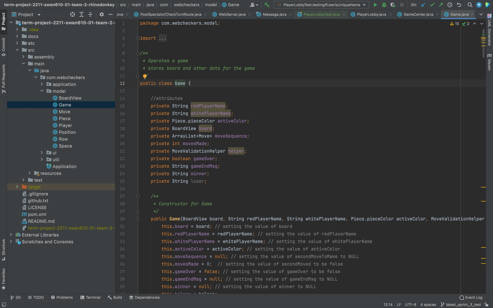
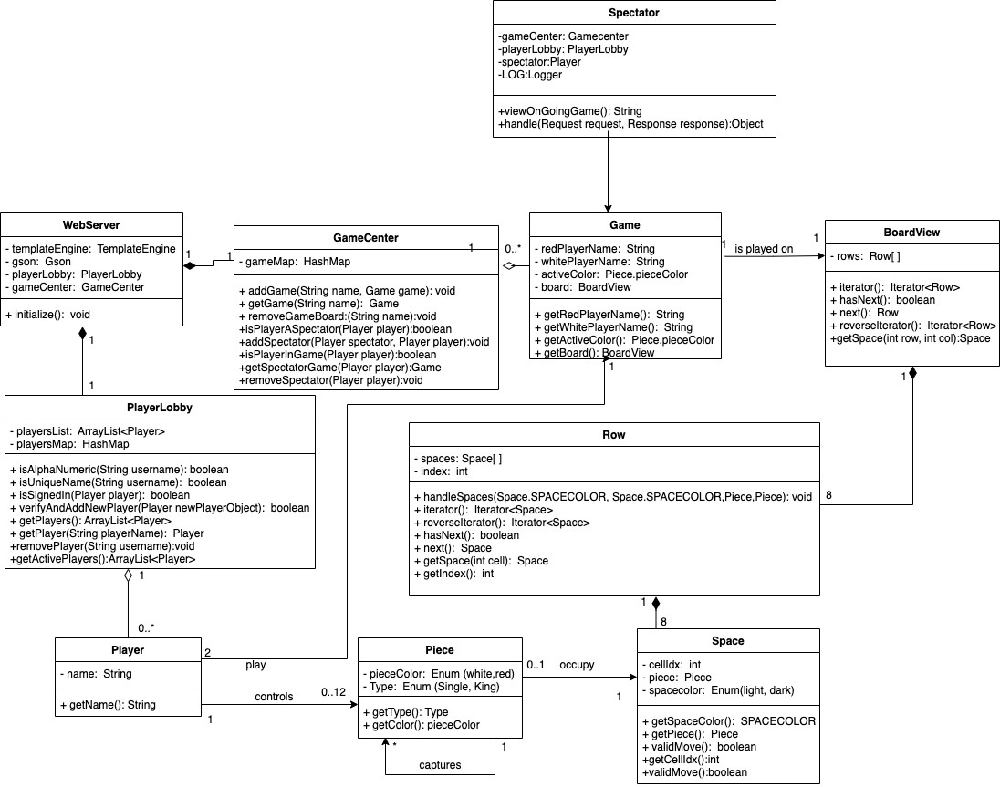

# PROJECT Design Documentation

> _The following template provides the headings for your Design
> Documentation.  As you edit each section make sure you remove these
> commentary 'blockquotes'; the lines that start with a > character
> and appear in the generated PDF in italics._

## Team Information

  * Mohamad Fazelnia
  * Spencer Herzog
  * Shubham Karun
  * Ruth Michael

## Executive Summary

Web checkers is a board game web application using Spark Java Framework. It allows users to sign in with a unique username, and play the game with other online players. A player should choose an opponent or be chosen by another player to start the game. The game follows american's chckers rules. The game allows other players to watch the game, and the game players can replay the game once finished.

### Purpose

> The goal of the project is to deliver a web based checkers game to be used by many players to play the checkers game following the American's rule. 

### Glossary and Acronyms
> _Provide a table of terms and acronyms._

| Term | Definition |
|------|------------|
| VO | Value Object |

## Requirements

This section describes the features of the application.
The online web checker application allows registered players to start an online checkers game between two players. When a player connects to the webserver, it will prompt them to sign in using a username with one Alphanumeric character. They will then be given a selection of additional players to choose from. The checker's board will be displayed, with each player's pieces in their proper locations. The first player is assigned a red piece to begin the game, while the second player is assigned a white piece. The game of checkers will then commence, with each player moving their pieces across the board in turn. Before completing a move, it is checked for validity. When a player advances a piece to the other side of the board, it becomes a king and has access to king moves. The game will go on until one of the players loses all of his pieces or resigns.

### Definition of MVP
The webcheker's Minimum Viable Product has the following features: 
1. Players can sign in using alpha numeric usernames before starting the game.
2. In order to participate in the games, the participants must make legitimate movements.
3. The webchecker informs players about the movements that are accessible to them at the bottom of the web page.
4.A player can leave the game at any time.
5.Users may watch the game by logging in as spectator.

### MVP Features
The Stories listed below are essential for the MVP.
Player Sign-in
As a Player I want to sign-in so that I can play a game of checkers.
Start a Game
As a Player I want to start a game so that I can play checkers with an opponent.

 Simple Move
 A single piece can move diagonally forward away from the player to a vacant space.

 Single Jump move
 - A piece needs to jump diagonally over the opponent’s piece to a vacant dark space so that it can capture the opponent’s piece. The piece can only jump over opponent’s pieces.

 Multiple Jump Move
 - A piece needs to be able to jump from a dark space over an opponent’s piece to a vacant dark space multiple times in the same turn to capture multiple pieces.

 King Me
 - A piece must be able to be upgraded to a king by reaching the furthest row, this allows a piece to move both away from the player or towards a player.

 Win Condition
 - The application needs to recognize when a player has no pieces left on the board to end the game and announce that the winner is the player with pieces remaining.

 Mandatory Jumping
- A piece is required to jump an opponent’s piece if there is the opportunity for a piece to jump. Multiple jumps must be completed as well as the piece cannot stop in the middle of the jump. The player may choose which jump to make in the case of several options.

 Player Turn Indicator
 - A game needs to make it evident that it is the player’s turn so that they know to go in and take their turn.

 Resignation
 - The Player must be able to resign (forfeit) any game he/she is playing.

 Spectator Observer
 - A player must not be able to interfere with a game that they are observing.

### Roadmap of Enhancements
 1.spectator mode; signed in users are able to watch the ongoing games without participating as players.
 2.replay the game; two players who had already played the game can be able to play the game again.

## Application Domain

This section describes the application domain.

> Each game has two players controlling 12 pieces on a single board composed of 64 squares.One player is red and the other is white. 

## Architecture and Design

This section describes the application architecture.

### Summary

The following Tiers/Layers model shows a high-level view of the webapp's architecture.

As a web application, the user interacts with the system using a
browser.  The client-side of the UI is composed of HTML pages with
some minimal CSS for styling the page.  There is also some JavaScript
that has been provided to the team by the architect.

The server-side tiers include the UI Tier that is composed of UI Controllers and Views.
Controllers are built using the Spark framework and View are built using the FreeMarker framework.  The Application and Model tiers are built using plain-old Java objects (POJOs).

Details of the components within these tiers are supplied below.

### Overview of User Interface

This section describes the web interface flow; this is how the user views and interacts
with the WebCheckers application.

> By rendering the home page of the checkers game, the player can sign into the game. The user can see a list of online users and choose a player as the opponent to start the game. The red user starts the game, and the turns changes accordingly. Once the game finished or any player resigned, both players are redirected to the home page.

### UI Tier
This tier contains all of the classes that control the view's routing for a certain set of actions taken while playing the game. Below are classes in our tier.

### Application Tier
The PlayerLobby and CenterGame classes make up this Tier. The GameCenter class keeps track of available games and adding a spectator. The player lobby is where players that are waiting for a game are kept. Below is a screenshot from our code

### Model Tier
The Model Tier defines the behavior of the game. Below is a screenshot from our code

### Class Diagram

### Design Improvements
> _Discuss design improvements that you would make if the project were
> to continue. These improvement should be based on your direct
> analysis of where there are problems in the code base which could be
> addressed with design changes, and describe those suggested design
> improvements. After completion of the Code metrics exercise, you
> will also discuss the resutling metric measurements.  Indicate the
> hot spots the metrics identified in your code base, and your
> suggested design improvements to address those hot spots._

## Testing
> _This section will provide information about the testing performed
> and the results of the testing._

### Acceptance Testing
> _Report on the number of user stories that have passed all their
> acceptance criteria tests, the number that have some acceptance
> criteria tests failing, and the number of user stories that
> have not had any testing yet. Highlight the issues found during
> acceptance testing and if there are any concerns._

### Unit Testing and Code Coverage
> _Discuss your unit testing strategy. Report on the code coverage
> achieved from unit testing of the code base. Discuss the team's
> coverage targets, why you selected those values, and how well your
> code coverage met your targets. If there are any anomalies, discuss
> those._
